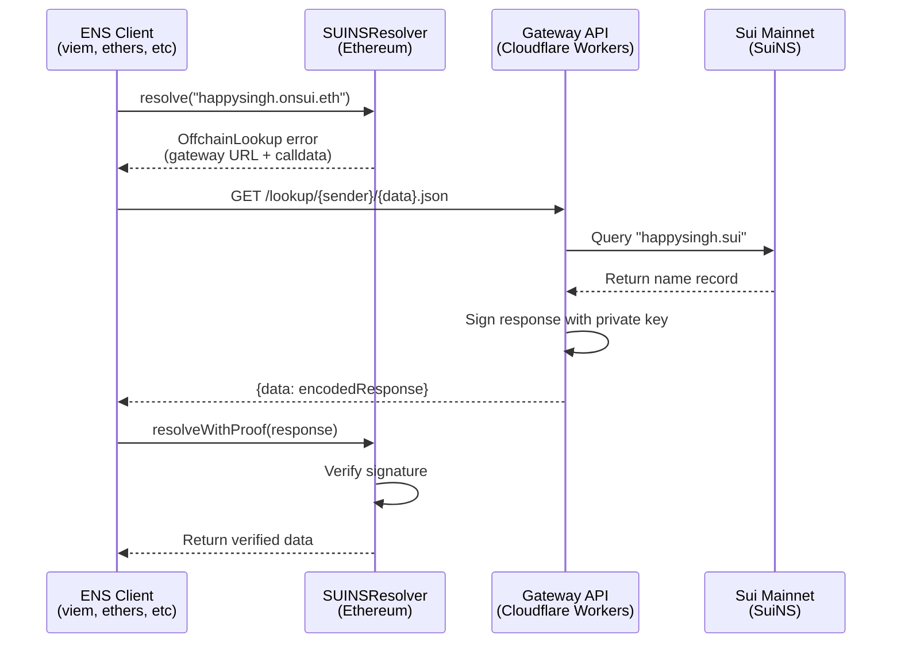

# Architecture

This doc explains how the SuiNS-ENS bridge works. If you want the "what" and "why," see the [README](README.md).

## The problem

You have `happysingh.sui` on Sui mainnet. You want to resolve it from Ethereum as `happysingh.onsui.eth` without bridging assets or deploying a separate registry.

ENS expects data on Ethereum. We can't put every SuiNS name on-chain—that's expensive and defeats the point of having names on Sui.

## The solution: CCIP-Read (EIP-3668)

EIP-3668 lets smart contracts fetch data from offchain APIs. The flow:



## Components

### 1. SUINSResolver (Ethereum contract)

[`contracts/contracts/OffchainResolver.sol`](contracts/contracts/OffchainResolver.sol)

This is an ENS resolver that implements `IExtendedResolver` (ENSIP-10). When you call `resolve()`, it doesn't return data—it reverts with an `OffchainLookup` error. That's the signal for CCIP-Read clients to fetch from the gateway.

The contract only does two things:
- Throw `OffchainLookup` errors pointing to the gateway
- Verify signatures in `resolveWithProof()` using ECDSA

The owner sets trusted signer addresses. The gateway signs responses with its private key. If the signature checks out and the signer is trusted, the contract returns the data.

### 2. Gateway (Cloudflare Workers)

[`gateway/src/index.ts`](gateway/src/index.ts)

The gateway is a Cloudflare Worker that:
1. Receives CCIP-Read requests at `/lookup/{sender}/{data}.json`
2. Decodes the calldata to figure out what you're asking for
3. Maps `happysingh.onsui.eth` → `happysingh.sui`
4. Queries Sui mainnet using `@mysten/suins` client
5. Formats the response (SUI address, avatar, contenthash, etc.)
6. Signs it with the private key
7. Returns JSON: `{data: "0x..."}`

The signing happens in [`gateway/src/ccip-read/utils.ts`](gateway/src/ccip-read/utils.ts). The signature covers:
- The sender address (resolver contract)
- Expiry timestamp
- Request calldata
- Response data

This prevents replay attacks and ensures responses can't be tampered with.

### 3. SuiNS client

[`gateway/src/suins.ts`](gateway/src/suins.ts)

This file handles the Sui → ENS name mapping:
- Strips `.onsui.eth` suffix
- Adds `.sui` suffix
- Queries Sui mainnet for the name record

It returns `targetAddress`, `avatar`, `contentHash`, and `walrusSiteId` from the SuiNS name object.

### 4. Query handler

[`gateway/src/ccip-read/query.ts`](gateway/src/ccip-read/query.ts)

This maps ENS queries to SuiNS fields:

| ENS function | SuiNS field | Notes |
|--------------|-------------|-------|
| `addr(784)` | `targetAddress` | Returns 32-byte SUI address |
| `addr(60)` | - | Returns zero address (no ETH mapping) |
| `text("avatar")` | `avatar` | Direct mapping |
| `text("contentHash")` | `contentHash` | Raw IPFS CID |
| `text("walrusSiteId")` | `walrusSiteId` | Walrus site ID |
| `text("org.suins.name")` | - | Returns original `.sui` name |
| `contenthash()` | `contentHash` | Encoded as ENSIP-7 (0xe301 + CIDv1) |

The contenthash encoding is tricky. SuiNS stores raw IPFS CIDs like `QmXxx` or `bafyxxx`. ENS expects ENSIP-7 format: `0xe301` (ipfs-ns namespace) followed by the CIDv1 bytes. We handle both CIDv0 and CIDv1 and convert to the right format.

## Security

**Signature verification:** The contract checks every response signature. You can't forge data without the private key.

**Trusted signers:** The contract owner controls who can sign. If a signer is compromised, the owner can remove it.

**Expiry timestamps:** Responses include an expiry. Old signed responses can't be replayed forever.

**What this doesn't protect against:**
- Gateway downtime (names won't resolve)
- Signer key compromise (attacker can forge responses until owner revokes the signer)
- Contract owner misbehavior (owner controls trusted signers)

This isn't trustless. You're trusting the gateway operator not to serve bad data. That's the tradeoff with CCIP-Read: you get cheap offchain data, but you rely on the gateway.

## Name mapping

`happysingh.onsui.eth` → `happysingh.sui`

The gateway only handles `.onsui.eth` subdomains. If you query something else, it errors.

This is hardcoded in [`gateway/src/suins.ts`](gateway/src/suins.ts):
```javascript
const PARENT_DOMAIN = 'onsui.eth'
```

You can run your own gateway with a different parent domain. Just deploy the contract, point it at your gateway, and set the trusted signers.

## Why Cloudflare Workers?

- Fast global edge network
- Free tier is generous
- Easy to deploy
- No servers to manage

You could run this on any hosting platform. The logic is simple: decode calldata, query Sui, sign response, return JSON.

## Testing locally

Start the gateway:
```bash
cd gateway
npm run dev
```

Run the test script:
```bash
npx tsx test.ts
```

This simulates what an ENS client does: encodes a query, calls the gateway, checks the response. It doesn't verify signatures (you'd need a deployed contract for that), but it confirms the gateway returns data.

## Deploying

See [`DEPLOYMENT.md`](DEPLOYMENT.md).
